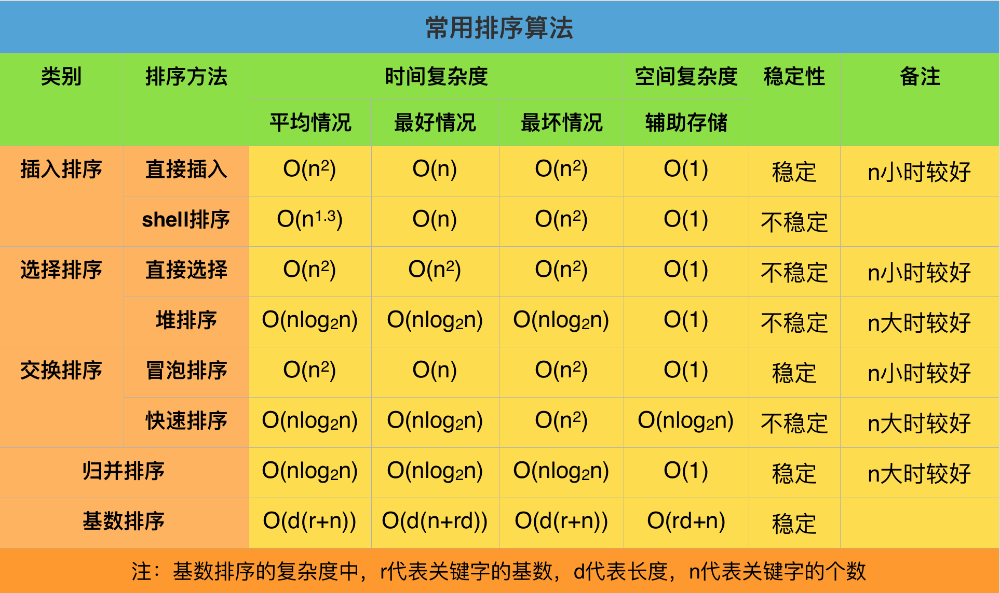

# 基本排序算法


## Bubble Sort 冒泡排序
### 思路
  通过**两个相邻元素的比较**来把最小或者最大的数交换到最后面

  平均复杂度 | 最好 | 最坏 | 空间 | 稳定性
  --- | --- | --- | --- | ---
  O(n^2) | O(n) | O(n^2) | O(1) | 稳定
### 实现
  [bubbleSort.js](./demo/bubbleSort.js)
  ``` javascript
  /**
   * Bubble Sort
   * @param {Array} arr
   */
  let bubbleSort = arr => {
    let len = arr.length

    for (let i = 0; i < len; i ++) {
      console.log(arr)
      for (let j = 0; j < len - i - 1; j ++) {
        if (arr[j] > arr[j + 1]) {
          // swap
          let temp = arr[j + 1]
          arr[j + 1] = arr[j]
          arr[j] = temp
        }
      }
    }

    return arr
  }

  let res = bubbleSort([2, 3, 1, 6, 5, 3, 9, 0])
  console.log('the res is ', res)
  ```

## Quik Sort 快速排序
  > 分治法典型应用。
### 思路
  1. 选取一个 `pivot` (基准)。
  2. 对数组中`除 pivot 外其他元素` 与 `pivot` 利用 `comparing function` (比较函数)进行比较，形成两个子集。
  3. 对两个子集不断重复第一步和第二步，直到**所有子集只剩下一个元素为止**。

  平均复杂度 | 最好 | 最坏 | 空间 | 稳定性
  --- | --- | --- | --- | ---
  O(n log n) | O(n log n) | O(n^2) | O(log n) | 不稳定
### 实现
  [quickSort.js](./demo/quickSort.js)
  ``` javascript
  /**
   * Quick Sort
   * @param {Array} arr array to be sorted
   * @param {Fuction} compare the compare function return with boolean
   */
  let quickSort = (arr, compare) => {
    if (arr.length <= 1) {
      return arr
    }
    console.log(arr)

    let pivot = arr[0]  // the pivot 基值
    let chunkT = [] // the chunk of whose return ture
    let chunkF = [] // the chunk of whose return false

    let i = 1 // avoid query the pivot
    for(i; i < arr.length; i ++) {
      // comparing
      if (compare(pivot, arr[i])) {
        chunkT.push(arr[i])
      } else {
        chunkF.push(arr[i])
      }
    }

    // concatenate the result
    return [quickSort(chunkT, compare), [pivot], quickSort(chunkF, compare)].reduce((a, b) => a.concat(b))
  }

  // the comparing function, which must reutrn with a boolean
  let compare = (a, b) => (a - b >= 0)

  let res = quickSort([2, 3, 1, 6, 5, 3, 9, 0], compare)
  console.log('result is ', res)
  ```

## Selection Sort 选择排序
### 思路
  选择一个最小/最大的数，记录下标，然后进行交换

  平均复杂度 | 最好 | 最坏 | 空间 | 稳定性
  --- | --- | --- | --- | ---
  O(n^2) | O(n^2) | O(n^2) | O(1) | 不稳定
### 实现
  ``` javascript
  let selectionSort = arr => {
    let len = arr.length
    let minIndex, temp

    for (let i = 0; i < len - 1; i++) {
      minIndex = i

      for (let j = i + 1; j < len; j++) {
        if (arr[j] < arr[minIndex]) {
          // find the min element's index
          minIndex = j
        }
      }

      temp = arr[i]
      arr[i] = arr[minIndex]
      arr[minIndex] =temp
    }

    return arr
  }

  let res = selectionSort([2, 3, 1, 6, 5, 3, 9, 0])
  console.log('the res is ', res)
  ```

