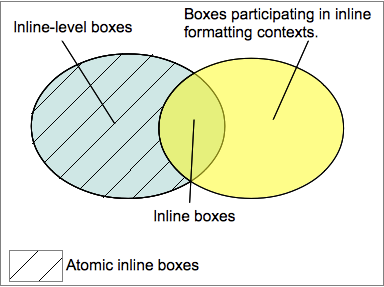

# Block Formating Context
- [Block Formating Context](#block-formating-context)
  - [概念](#%E6%A6%82%E5%BF%B5)
  - [常见创建 BFC 的方法](#%E5%B8%B8%E8%A7%81%E5%88%9B%E5%BB%BA-bfc-%E7%9A%84%E6%96%B9%E6%B3%95)
- [Inline Formating Context](#inline-formating-context)
  - [表现](#%E8%A1%A8%E7%8E%B0)
  - [条件](#%E6%9D%A1%E4%BB%B6)
  - [相关](#%E7%9B%B8%E5%85%B3)
    - [Inline-level elements](#inline-level-elements)
    - [atomic inline-level box](#atomic-inline-level-box)
    - [inline-level box](#inline-level-box)
    - [inline box](#inline-box)
    - [line box](#line-box)

## 概念
> A block formatting context is a part of a visual CSS rendering of a Web page. It is the region in which the layout of block boxes occurs and in which floats interact with other elements.

> 块格式化上下文（Block Formatting Context，BFC） 是Web页面的可视化CSS渲染的部分，是块级盒布局发生的区域，也是浮动元素与其他元素交互的区域。

简言之，在 BFC 内部的子元素不会影响外部的元素，例如清除内部浮动，防止 `margin` 穿透。

## 常见创建 BFC 的方法
- 浮动元素 (元素的 `float` 不是 `none`)
- 绝对定位元素 (元素的 `position` 为 `absolute` 或 `fixed`)
- `display: inline-block`
- 表格单元格或表格标题(`display: table-cell`/`display: table-caption`)
- `overflow` 值不为 `visible` 的块元素

# Inline Formating Context
## 表现
直译为内联/行内格式化上下文，表现为 inline-level box 布局方式与规则。
## 条件
IFC 只有在一个块级元素中**仅包含**内联元素时才会生成。
## 相关

### Inline-level elements 
> An element is said to be inline-level when the calculated value of its `display` CSS property is: `inline`, `inline-block` or `inline-table`.
### atomic inline-level box
> Inline-level boxes, whose contents do not participate in an inline formatting context, are called **atomic inline-level boxes**. These boxes, generated by replaced inline-level elements or by elements with a calculated display value of inline-block or inline-table, are never split into several boxes, as is possible with inline boxes.

atomic inline-level box 在 IFC 里不能拆分成多行。

常见：
- replaced inline-level elements (可替换的行内级元素)
- `display: inline-block` 
- `display: inline-table`

### inline-level box
> "Inline-level elements generate inline-level boxes, which are boxes that participate in an inline formatting context", see CSS 2.2, chapter 9.2.2

inline-level element (行内级元素)形成参与 IFC 的 inline-level box (行内级盒子)

### inline box
> Inline boxes are both inline-level boxes and boxes, whose contents participate in their container's inline formatting context. 

参与 IFC 的 inline-level box

### line box
> Line boxes are generated by the inline formatting context to represent a line of text. Inside a block box, a line box extends from one border of the box to the other. When there are floats, the line box starts at the rightmost border of the left floats and ends at the leftmost border of the right floats.

> 行盒由行内格式化上下文(inline formatting context)产生的盒，用于表示一行。在块盒里面，行盒从块盒一边排版到另一边。 当有浮动时, 行盒从左浮动的最右边排版到右浮动的最左边。
