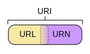
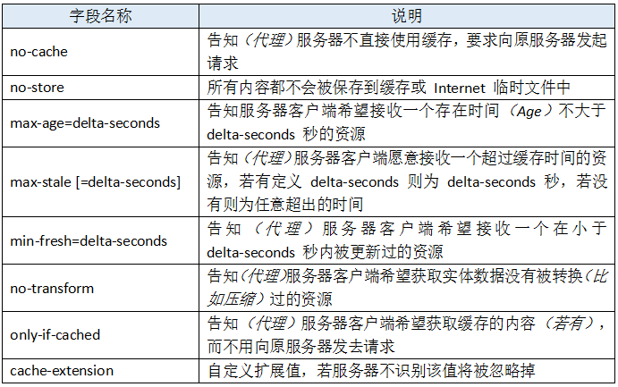

# HTTP相关
- [HTTP相关](#http%E7%9B%B8%E5%85%B3)
  - [URI & URL](#uri-url)
  - [状态码](#%E7%8A%B6%E6%80%81%E7%A0%81)
    - [1xx 信息](#1xx-%E4%BF%A1%E6%81%AF)
    - [2xx 成功](#2xx-%E6%88%90%E5%8A%9F)
    - [3xx 重定向](#3xx-%E9%87%8D%E5%AE%9A%E5%90%91)
    - [4xx 客户端错误](#4xx-%E5%AE%A2%E6%88%B7%E7%AB%AF%E9%94%99%E8%AF%AF)
    - [5xx 服务端错误](#5xx-%E6%9C%8D%E5%8A%A1%E7%AB%AF%E9%94%99%E8%AF%AF)
  - [常见的 content-type](#%E5%B8%B8%E8%A7%81%E7%9A%84-content-type)
  - [缓存相关](#%E7%BC%93%E5%AD%98%E7%9B%B8%E5%85%B3)
    - [强缓存](#%E5%BC%BA%E7%BC%93%E5%AD%98)
    - [协商缓存](#%E5%8D%8F%E5%95%86%E7%BC%93%E5%AD%98)
    - [缓存头部对比](#%E7%BC%93%E5%AD%98%E5%A4%B4%E9%83%A8%E5%AF%B9%E6%AF%94)
  - [Cookie 相关](#cookie-%E7%9B%B8%E5%85%B3)
    - [服务端设置 cookie](#%E6%9C%8D%E5%8A%A1%E7%AB%AF%E8%AE%BE%E7%BD%AE-cookie)
    - [客户端设置 cookie](#%E5%AE%A2%E6%88%B7%E7%AB%AF%E8%AE%BE%E7%BD%AE-cookie)
    - [跨域](#%E8%B7%A8%E5%9F%9F)

## URI & URL
  - URI = Universal Resource **Identifier** 统一资源标识符
  - URL = Universal Resource **Locator** 统一资源定位符
  - URN = Universal Resource Name 统一资源名称

  这三者关系如下图：

  

  URL代表资源的路径地址，而URI代表资源的唯一标识符。

## 状态码
  ### 1xx 信息
  code | 状态 | 描述
  -- | ---- | --------
  100 | Continue | 服务器仅接收到部分请求，但是一旦服务器并没有拒绝该请求，客户端应该继续发送其余的请求。
  101 | Switching Protocols	| 服务器转换协议：服务器将遵从客户的请求转换到另外一种协议。

  ### 2xx 成功
  code | 状态 | 描述
  -- | ---- | --------
  **200** | OK	|请求成功（其后是对GET和POST请求的应答文档。）
  201 | Created	|请求被创建完成，同时新的资源被创建。
  202 | Accepted	|供处理的请求已被接受，但是处理未完成。
  203 | Non-authoritative Information|文档已经正常地返回，但一些应答头可能不正确，因为使用的是文档的拷贝。
  204 | No Content|	没有新文档。浏览器应该继续显示原来的文档。如果用户定期地刷新页面，而Servlet可以确定用户文档足够新，这个状态代码是很有用的。
  205 | Reset Content|	没有新文档。但浏览器应该重置它所显示的内容。用来强制浏览器清除表单输入内容。
  206 | Partial Content|	客户发送了一个带有Range头的GET请求，服务器完成了它。

  ### 3xx 重定向
  code | 状态 | 描述
  -- | ---- | --------
  300 | Multiple Choices |	多重选择。链接列表。用户可以选择某链接到达目的地。最多允许五个地址。
  301 | Moved Permanently |	所请求的页面已经转移至新的url。(永久移动) 
  302 | Found |	所请求的页面已经临时转移至新的url。(临时移动) 
  303 | See Other |	所请求的页面可在别的url下被找到。
  **304** | Not Modified |	未按预期修改文档。客户端有缓冲的文档并发出了一个条件性的请求（一般是提供If-Modified-Since头表示客户只想比指定日期更新的文档）。服务器告诉客户，原来缓冲的文档还可以继续使用。
  305 | Use Proxy |	客户请求的文档应该通过Location头所指明的代理服务器提取。
  306 | Unused |	此代码被用于前一版本。目前已不再使用，但是代码依然被保留。
  307 | Temporary Redirect |	被请求的页面已经临时移至新的url。

  ### 4xx 客户端错误
  code | 状态 | 描述
  -- | ---- | --------
  **400** | Bad Request |	服务器未能理解请求。
  **401** | Unauthorized |	被请求的页面需要用户名和密码。
  402 | Payment Required |	此代码尚无法使用。
  **403** | Forbidden |	对被请求页面的访问被禁止。
  **404** | Not Found |	服务器无法找到被请求的页面。
  **405** | Method Not Allowed |	请求中指定的方法不被允许。
  406 | Not Acceptable |	服务器生成的响应无法被客户端所接受。
  407 | Proxy Authentication Required |	用户必须首先使用代理服务器进行验证，这样请求才会被处理。
  408 | Request Timeout |	请求超出了服务器的等待时间。
  409 | Conflict |	由于冲突，请求无法被完成。
  410 | Gone |	被请求的页面不可用。
  411 | Length Required |	"Content-Length" 未被定义。如果无此内容，服务器不会接受请求。
  412 | Precondition Failed |	请求中的前提条件被服务器评估为失败。
  413 | Request Entity Too Large |	由于所请求的实体的太大，服务器不会接受请求。
  414 | Request-url Too Long |	由于url太长，服务器不会接受请求。当post请求被转换为带有很长的查询信息的get请求时，就会发生这种情况。
  415 | Unsupported Media Type |	由于媒介类型不被支持，服务器不会接受请求。

  ### 5xx 服务端错误
  code | 状态 | 描述
  -- | ---- | --------
  **500** | Internal Server Error	|请求未完成。服务器遇到不可预知的情况。
  501 | Not Implemented	|请求未完成。服务器不支持所请求的功能。
  502 | Bad Gateway	请求未完成。|服务器从上游服务器收到一个无效的响应。
  503 | Service Unavailable	|请求未完成。服务器临时过载或当机。
  504 | Gateway Timeout	|网关超时。
  505 | HTTP Version Not Supported|	服务器不支持请求中指明的HTTP协议版本。

## 常见的 content-type
  - `application/x-www-form-urlencoded`

    浏览器的原生 form 表单，如果不设置 enctype 属性，那么最终就会以 application/x-www-form-urlencoded 方式提交数据。请求如下面形式:
    ```
    POST http://www.example.com HTTP/1.1
    Content-Type: application/x-www-form-urlencoded;charset=utf-8

    title=test&sub%5B%5D=1&sub%5B%5D=2&sub%5B%5D=3
    ```
    该种方式提交的数据**放在 body 里面**，数据按照 key1=val1&key2=val2 的方式进行编码，key 和 val 都**进行了 URL 转码**。

  - `multipart/form-data`

    该种方式也是一个常见的 POST 提交方式，**通常表单上传文件时使用该种方式**。请求类似下面形式:
    ```
    POST http://www.example.com HTTP/1.1
    Content-Type:multipart/form-data; boundary=----WebKitFormBoundaryrGKCBY7qhFd3TrwA

    ------WebKitFormBoundaryrGKCBY7qhFd3TrwA
    Content-Disposition: form-data; name="text"

    title
    ------WebKitFormBoundaryrGKCBY7qhFd3TrwA
    Content-Disposition: form-data; name="file"; filename="chrome.png"
    Content-Type: image/png

    PNG ... content of chrome.png ...
    ------WebKitFormBoundaryrGKCBY7qhFd3TrwA--
    ```
    首先 `Content-Type` 指明数据以 `multipart/form-data` 方式编码，同时后面跟一个 `boundary` 标识分隔符。
    body 里字段分多个部分，每部分以 `boundary` 开始，然后是内容描述信息，回车空行(CRLF)之后是字段的具体内容，内容可以是文本或者二进制形式。如果传输文件，需要包含文件名和文件类型信息。最后加上一行 `boundary` 表示数据结束。

  - `application/json`

    `application/json` 作为响应头或者请求头，用来告诉服务器消息主体是序列化后的 JSON 字符串。请求类似下面形式:
    ```
    POST http://www.example.com HTTP/1.1
    Content-Type: application/json;charset=utf-8

    {"title":"test","sub":[1,2,3]}
    ```

## 缓存相关
  ### 强缓存
  - http1.0 时代，给客户端设定缓存方式可通过两个字段—— `Pragma` 和 `Expires` 来规范。
    - `Pragma` 字段值为 `no-cache `的时候（事实上现在 RFC 中也仅标明该可选值），会通知客户端**不要对该资源读缓存**，即每次都得向服务器发一次请求才行。且 `Pragma` 的优先级高于 `Cache-Control`。
    - `Expires` 的值对应一个 GMT（格林尼治时间），比如 Mon, 22 Jul 2002 11:12:01 GMT 来告诉浏览器**资源缓存过期时间**，如果还没过该时间点则不发请求。`Expires` 所定义的缓存时间是**相对服务器上的时间**而言的。
    - 如果 `Pragma` 头部和 `Expires` 头部同时存在，则起作用的会是 `Pragma`
  - http1.1 新增了 `Cache-Control` 来定义缓存过期时间, 在 RFC 中规范了 `Cache-Control` 的格式为：
    - 作为请求头：

      
    - 作为响应头：

      
  - 优先级： `Pragma` > `Cache-Control` > `Expires`
  ### 协商缓存
  - `Etag` 和 `If-None-Match`
    - `Etag` 和 `If-None-Match` 返回的是一个校验码。**ETag可以保证每一个资源是唯一的，资源变化都会导致ETag变化**。服务器根据请求头中的的 `If-None-Match` 值来判断是否命中缓存。
  - `Last-Modify` 和 `If-Modify-Since`
    - 浏览器第一次请求一个资源的时候，服务器返回的 header 中会加上 `Last-Modify`，`Last-modify` 是一个时间标识该资源的最后修改时间。当浏览器再次请求该资源时，request 的请求头中会包含 `If-Modify-Since`，该值为缓存之前返回的 `Last-Modify`。服务器收到 `If-Modify-Since` 后，**根据资源的最后修改时间判断是否命中缓存**。如果命中缓存，则返回 `304`，并且不会返回资源内容，也不会返回 `Last-Modify`。
  - `Last-Modified`与 `ETag` 是可以一起使用的，服务器会优先验证 `ETag`，一致的情况下，才会继续比对 `Last-Modified`，最后才决定是否返回 `304`。

  ### 缓存头部对比
  | 头部          | 优势和特点                                                                                                           | 劣势和问题                                                                                                                                                                                                                          |
  | ------------- | -------------------------------------------------------------------------------------------------------------------- | ----------------------------------------------------------------------------------------------------------------------------------------------------------------------------------------------------------------------------------- |
  | Expires       | 1. HTTP 1.0 产物，可以在HTTP 1.0和1.1中使用，简单易用。2. 以时刻标识失效时间。                                       | 1. 时间是由服务器发送的(UTC)，如果服务器时间和客户端时间存在不一致，可能会出现问题。2. 存在版本问题，到期之前的修改客户端是不可知的。                                                                                               |
  | Cache-Control | 1. HTTP 1.1 产物，以时间间隔标识失效时间，解决了Expires服务器和客户端相对时间的问题。2. 比Expires多了很多选项设置。  | 1. HTTP 1.1 才有的内容，不适用于HTTP 1.0 。2. 存在版本问题，到期之前的修改客户端是不可知的。                                                                                                                                        |
  | Last-Modified | 1. 不存在版本问题，每次请求都会去服务器进行校验。服务器对比最后修改时间如果相同则返回304，不同返回200以及资源内容。  | 1. 只要资源修改，无论内容是否发生实质性的变化，都会将该资源返回客户端。例如周期性重写，这种情况下该资源包含的数据实际上一样的。2. 以时刻作为标识，无法识别一秒内进行多次修改的情况。3. 某些服务器不能精确的得到文件的最后修改时间。 |
  | ETag          | 1. 可以更加精确的判断资源是否被修改，可以识别一秒内多次修改的情况。2. 不存在版本问题，每次请求都回去服务器进行校验。 | 1. 计算ETag值需要性能损耗。2. 分布式服务器存储的情况下，计算ETag的算法如果不一样，会导致浏览器从一台服务器上获得页面内容后到另外一台服务器上进行验证时发现ETag不匹配的情况。                                                        |

## Cookie 相关
  - 客户端请求服务器后，如果服务器需要记录用户状态，服务器会在响应信息中包含一个 `Set-Cookie` 的响应头，客户端会根据这个响应头存储 Cookie 信息。再次请求服务器时，客户端会在请求信息中包含一个`Cookie` 请求头，而服务器会根据这个请求头进行用户身份、状态等较验。

    

  - 格式：`key0=value0; key1=value1` 形式的字符串，由键值对 `key=value` 构成，键值对之间**由一个分号和一个空格隔开。**
  - 大小限制：4 KB
  - 在发**同域请求**时，浏览器会将 cookie 自动加在 request header中。

  ### 服务端设置 cookie
  - 一个 `set-Cookie` 字段只能设置一个 `cookie`，当你要想设置多个 `cookie`，需要添加同样多的 `set-Cookie` 字段。
  - 服务端可以设置 `cookie` 的所有选项：`expires`、`domain`、`path`、`secure`、`HttpOnly`

  ### 客户端设置 cookie
  - 添加：客户端可以设置 cookie 的下列选项：`expires`、`domain`、`path`、`secure`（有条件：只有在 https 协议的网页中，客户端设置 `secure` 类型的 cookie 才能成功），但无法设置 `HttpOnly` 选项。例子如下：
  ``` javascript
  document.cookie="age=12; expires=Thu, 26 Feb 2116 11:50:25 GMT; domain=sankuai.com; path=/";
  ```
  下面代码只会添加第一个 cookie `name=John`：
  ``` javascript
  document.cookie = "name=Jonh; age=12; class=111";
  ```
  - 修改：要想修改一个 cookie，只需要重新赋值就行，旧的值会被新的值覆盖。但要注意一点，在设置新 cookie 时，`path`/`domain` 这几个选项一定要旧 cookie **保持一样**。否则不会修改旧值，而是添加了一个新的 cookie。
  - 删除：删除一个 cookie 也是重新赋值，只要将这个新 cookie 的 `expires` 选项设置为一个**过去的时间点**就行了。但同样要注意，`path`/`domain` 这几个选项一定要旧 cookie 保持一样。

  ### 跨域
  默认情况下，浏览器在发送跨域请求时，不能发送任何认证信息（credentials）如"cookies"和"HTTP authentication schemes"。除非 `xhr.withCredentials` 为 `true`（xhr对象有一个属性叫 `withCredentials`，默认值为 `false`）。

  若要在跨域请求中携带 cookie，**client 端必须手动设置 `xhr.withCredentials=true`，且 server 端也必须允许 request 能携带认证信息（即 response header 中包含 `Access-Control-Allow-Credentials:true`）**，这样浏览器才会自动将 cookie 加在 request header 中。

  另外，要特别注意一点，一旦跨域 request 能够携带认证信息，server 端一定不能将 `Access-Control-Allow-Origin` 设置为 `*`，而**必须设置为请求页面的域名**。